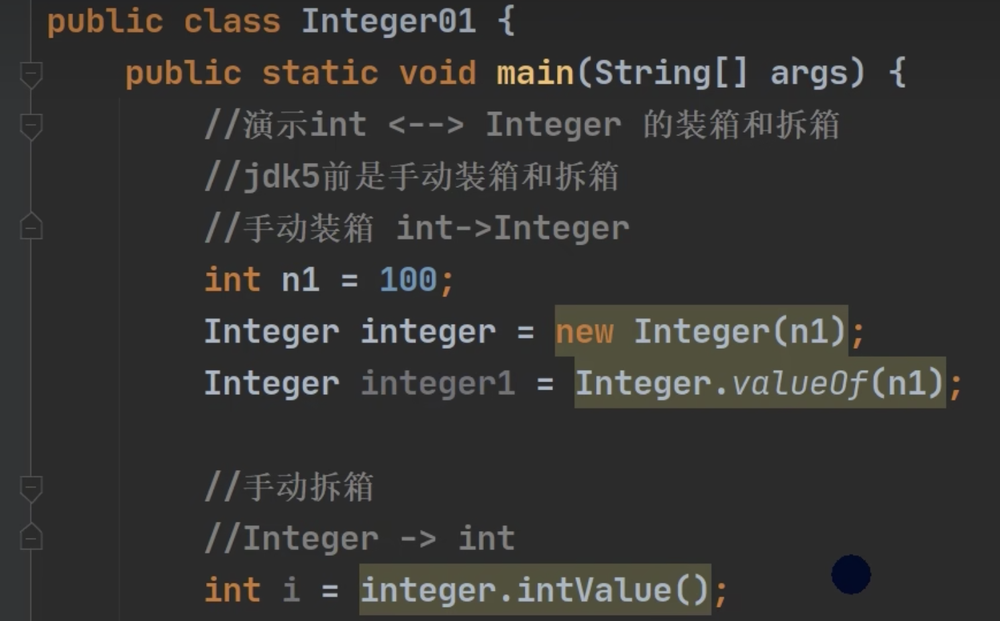

# 【4】 面向对象

:::info
<font style="color:rgb(51, 51, 51);">洗衣服举例</font>

**<font style="color:rgb(51, 51, 51);">面向过程：</font>**

<font style="color:rgb(51, 51, 51);">放入衣服 -> 洗衣机开始清洗 -> 洗衣机开始甩干 -> 取出衣服</font>

**<font style="color:rgb(51, 51, 51);">面向对象：</font>**

<font style="color:rgb(51, 51, 51);">把洗衣服这件拆出来 2个对象</font>

<font style="color:rgb(51, 51, 51);">人  只负责  放衣服和取衣服</font>

<font style="color:rgb(51, 51, 51);">洗衣机 只负责 清洗 和 甩干</font>

<font style="color:rgb(51, 51, 51);">面向对象的好处是：一个人的 可以对应不同洗衣机  一个洗衣机 也可以 对应 不同的人 </font>

<font style="color:rgb(51, 51, 51);">从代码上来说就是提高 代码的复用性 解除代码之间的耦合度  </font>

<font style="color:rgb(51, 51, 51);">但是不能说 面向对象就一定比面向过程要好  他们是思想不一样</font>

:::

| **<font style="color:rgb(51, 51, 51);">现实世界</font>** | **<font style="color:rgb(51, 51, 51);">计算机模型</font>** | **<font style="color:rgb(51, 51, 51);">Java代码</font>** |
| :--- | :--- | :--- |
| <font style="color:rgb(51, 51, 51);">人</font> | <font style="color:rgb(51, 51, 51);">类 / class</font> | <font style="color:rgb(51, 51, 51);">class Person { }</font> |
| <font style="color:rgb(51, 51, 51);">小明</font> | <font style="color:rgb(51, 51, 51);">实例 / ming</font> | <font style="color:rgb(51, 51, 51);">Person ming = new Person()</font> |
| <font style="color:rgb(51, 51, 51);">小红</font> | <font style="color:rgb(51, 51, 51);">实例 / hong</font> | <font style="color:rgb(51, 51, 51);">Person hong = new Person()</font> |
| <font style="color:rgb(51, 51, 51);">小军</font> | <font style="color:rgb(51, 51, 51);">实例 / jun</font> | <font style="color:rgb(51, 51, 51);">Person jun = new Person()</font> |


<font style="color:rgb(51, 51, 51);">同样的，“书”也是一种抽象的概念，所以它是类，而《Java 核心技术》、《Java 编程思想》、《Java 学习笔记》则是实例：</font>

| **<font style="color:rgb(51, 51, 51);">现实世界</font>** | **<font style="color:rgb(51, 51, 51);">计算机模型</font>** | **<font style="color:rgb(51, 51, 51);">Java代码</font>** |
| :--- | :--- | :--- |
| <font style="color:rgb(51, 51, 51);">书</font> | <font style="color:rgb(51, 51, 51);">类 / class</font> | <font style="color:rgb(51, 51, 51);">class Book { }</font> |
| <font style="color:rgb(51, 51, 51);">Java核心技术</font> | <font style="color:rgb(51, 51, 51);">实例 / book1</font> | <font style="color:rgb(51, 51, 51);">Book book1 = new Book()</font> |
| <font style="color:rgb(51, 51, 51);">Java编程思想</font> | <font style="color:rgb(51, 51, 51);">实例 / book2</font> | <font style="color:rgb(51, 51, 51);">Book book2 = new Book()</font> |
| <font style="color:rgb(51, 51, 51);">Java学习笔记</font> | <font style="color:rgb(51, 51, 51);">实例 / book3</font> | <font style="color:rgb(51, 51, 51);">Book book3 = new Book()</font> |


# <font style="color:rgb(51, 51, 51);">定义类</font>
定义一个人类：

```java
class Person{
    public String name;
    public int age;
}

```

# 创建实例
<font style="color:rgb(51, 51, 51);">定义了 class，只是定义了对象模版，而要根据对象模版创建出真正的对象实例，</font>**<font style="color:rgb(51, 51, 51);">必须用 new 操作符</font>**<font style="color:rgb(51, 51, 51);">。</font>

<font style="color:rgb(51, 51, 51);">new 操作符可以创建一个实例，然后，我们需要定义一个引用类型的变量来指向这个实例：</font>

`Person ming = new Person(); `

<font style="color:rgb(51, 51, 51);">上述代码创建了一个 Person 类型的实例，并通过变量 </font><font style="color:rgb(51, 51, 51);background-color:rgb(250, 250, 250);">ming </font><font style="color:rgb(51, 51, 51);">指向它。</font>

<font style="color:rgb(51, 51, 51);">注意区分</font>`<font style="color:rgb(51, 51, 51);background-color:rgb(250, 250, 250);">Person ming</font>`<font style="color:rgb(51, 51, 51);">是定义</font>`<font style="color:rgb(51, 51, 51);background-color:rgb(250, 250, 250);">Person</font>`<font style="color:rgb(51, 51, 51);">类型的变量</font>`<font style="color:rgb(51, 51, 51);background-color:rgb(250, 250, 250);">ming</font>`<font style="color:rgb(51, 51, 51);">，而</font>`<font style="color:rgb(51, 51, 51);background-color:rgb(250, 250, 250);">new Person()</font>`<font style="color:rgb(51, 51, 51);">是创建</font>`<font style="color:rgb(51, 51, 51);background-color:rgb(250, 250, 250);">Person</font>`<font style="color:rgb(51, 51, 51);">实例。</font>

<font style="color:rgb(51, 51, 51);">有了指向这个实例的变量，我们就可以通过这个变量来操作实例。访问实例变量可以用</font>`<font style="color:rgb(51, 51, 51);background-color:rgb(250, 250, 250);">变量.字段</font>`<font style="color:rgb(51, 51, 51);">，例如：</font>

```java
ming.name = "Xiao Ming"; // 对字段 name 赋值 
ming.age = 12; // 对字段 age 赋值
System.out.println(ming.name); // 访问字段 name
Person hong = new Person(); 
hong.name = "Xiao Hong"; 
hong.age = 15; 
```

注意：一个Java源文件可以包含多个类的定义，但**只能定义一个 public 类**，且public类名必须与文件名一致。如果要定义多个 public 类，必须拆到多个 Java 源文件中。

# <font style="color:rgb(51, 51, 51);">方法</font>
如果我们想要直接操作类里面的属性，那可能会造成一些不好的后果，就破坏了类的封装性。

所以我们可以使用一些方法来对属性进更改。

```java
public class Main {
    public static void main(String[] args) {
        Person ming = new Person();
        ming.setName("Xiao Ming"); // 设置name
        ming.setAge(12); // 设置age
        System.out.println(ming.getName() + ", " + ming.getAge());
    }
}

class Person {
    private String name;
    private int age;

    public String getName() {
        return this.name;
    }

    public void setName(String name) {
        this.name = name;
    }

    public int getAge() {
        return this.age;
    }

    public void setAge(int age) {
        if (age < 0 || age > 100) {
            throw new IllegalArgumentException("invalid age value");
        }
        this.age = age;
    }
}
```

在类的里面定义一些方法，可以有效的对属性数值的更改进行一个范围设置，比如年龄是0-100的范围。

外部代码就可以通过调用方法来进行间接修改字段。

除了这种被外部可以调用的`public`的方法也可以替换成为`private`关键字，将其定义为私有方法，是得外部没办法调用它，但是内部的方法可以进行调用。

```java
public class Main {
    public static void main(String[] args) {
        Person ming = new Person();
        ming.setBirth(2008);
        System.out.println(ming.getAge());
    }
}

class Person {
    private String name;
    private int birth;

    public void setBirth(int birth) {
        this.birth = birth;
    }

    public int getAge() {
        return calcAge(2019); // 调用private方法
    }

    // private方法:
    private int calcAge(int currentYear) {
        return currentYear - this.birth;
    }
}

```

`public int getAge`是公开方法，他调用了 私有方法 `calAge`。

## this 关键字
<font style="color:rgb(51, 51, 51);">在方法内部，可以看到上面使用了一个隐含的变量</font>`<font style="color:rgb(51, 51, 51);background-color:rgb(250, 250, 250);">this</font>`<font style="color:rgb(51, 51, 51);">，它始终指向当前实例。因此，通过</font>`<font style="color:rgb(51, 51, 51);background-color:rgb(250, 250, 250);">this.属性</font>`<font style="color:rgb(51, 51, 51);">就可以访问当前实例的字段。</font>

<font style="color:rgb(51, 51, 51);">如果没有命名冲突，可以省略</font>`<font style="color:rgb(51, 51, 51);">this</font>`<font style="color:rgb(51, 51, 51);">，</font>

```java
class Person{
    private String name;
    public String getName(){
        return name;
    }
}
```

但是，如果有局部变量和字段重名，那么就是局部变量优先级更高，就必须加上`this`。

```java
class Person{
    private String name;
    public void setName(String name){
        this.name = name;
    }
}
```

局部变量 name， 也就是 setName 里面的 name 的优先级更高，去了区别两个变量，就应该在里面加上`this`。

## 方法参数
```java
class Person {
    ...
    public void setNameAndAge(String name, int age) {
        ...
    }
}
```

第一个参数是 String，第二个参数是 int。

## 可变参数
可变参数用`类型...`定义，相当于数组类型。

```java
class Group {
    private String[] names;

    public void setNames(String... names) {
        this.names = names;
    }
}
```

```java
Group g = new Group();
g.setNames("Xiao Ming", "Xiao Hong", "Xiao Jun"); // 传入3个String
g.setNames("Xiao Ming", "Xiao Hong"); // 传入2个String
g.setNames("Xiao Ming"); // 传入1个String
g.setNames(); // 传入0个String
```

也可以这么写

```java
class Group {
    private String[] names;

    public void setNames(String[] names) {
        this.names = names;
    }
}
```

<font style="color:rgb(51, 51, 51);">但是，调用方需要自己先构造</font><font style="color:rgb(51, 51, 51);background-color:rgb(250, 250, 250);">String[]</font><font style="color:rgb(51, 51, 51);">，比较麻烦。例如：</font>

```java
Group g = new Group();
g.setNames(new String[] {"Xiao Ming", "Xiao Hong", "Xiao Jun"}); // 传入1个String[]
```

## 构造方法（构造器）
创建实例的时候，需要**初始化实例**的对象，就可以使用构造方法。

简而言之，就是构造方法要在实例的时候一次性传入参数的内容。

而不是后面在调用方法的时候，在进行参数的传入。

比如说，下面的代码：

```java
public class Main {
    public static void main(String[] args) {
        Person p = new Person("Xiao Ming", 15);
        System.out.println(p.getName());
        System.out.println(p.getAge());
    }
}

class Person {
    private String name;
    private int age;

    public Person(String name, int age) {
        this.name = name;
        this.age = age;
    } //构造方法，名称同类名

    public String getName() {
        return this.name;
    }

    public int getAge() {
        return this.age;
    }
}

```

这里我们可以说构造方法人类。（**构造方法的名称就是类名**。）<font style="color:rgb(51, 51, 51);">构造方法的参数没有限制，在方法内部，也可以编写任意语句。但是，和普通方法相比，构造方法</font>**<font style="color:rgb(51, 51, 51);">没有返回值</font>**<font style="color:rgb(51, 51, 51);">（也没有</font>`<font style="color:rgb(51, 51, 51);background-color:rgb(250, 250, 250);">void</font>`<font style="color:rgb(51, 51, 51);">），调用构造方法，必须用</font>`<font style="color:rgb(51, 51, 51);background-color:rgb(250, 250, 250);">new</font>`<font style="color:rgb(51, 51, 51);">操作符。</font>

<font style="color:rgb(51, 51, 51);">所有 class 都有构造方法，但是在第一个例子中，没有写构造方法，这是因为编译器可以自动生成一个默认的构造方法。如下所示：</font>

```java
class Person{
    public Person{
    }
}
```

<font style="color:rgb(51, 51, 51);">主要注意的是，如果自定义了一个构造方法，那么编译器就不会再自动创建构造方法了。</font>

<font style="color:rgb(51, 51, 51);">如果想要既带参数的构造方法，也可以定义不带参数的构造方法，那么可以把两个构造方法均定义出来。</font>

<font style="color:rgb(51, 51, 51);">如果既对字段进行初始化，又在构造方法中对字段进行初始化，那会发生什么？</font>

```java
class Person {
    private String name = "Unamed";
    private int age = 10;

    public Person(String name, int age) {
        this.name = name;
        this.age = age;
    }
}
```

<font style="color:rgb(51, 51, 51);">当我们创建对象的时候，</font>`<font style="color:rgb(51, 51, 51);background-color:rgb(250, 250, 250);">new Person("Xiao Ming", 12)</font>`<font style="color:rgb(51, 51, 51);">得到的对象实例，字段的初始值是啥？</font>

<font style="color:rgb(51, 51, 51);">在 Java 中，创建对象实例的时候，按照如下顺序进行初始化：</font>

1. <font style="color:rgb(51, 51, 51);">先初始化字段，例如，</font>`<font style="color:rgb(51, 51, 51);background-color:rgb(250, 250, 250);">int age = 10</font>`<font style="color:rgb(51, 51, 51);background-color:rgb(250, 250, 250);">;</font><font style="color:rgb(51, 51, 51);">表示字段初始化为</font>`<font style="color:rgb(51, 51, 51);background-color:rgb(250, 250, 250);">10</font>`<font style="color:rgb(51, 51, 51);">，</font>`<font style="color:rgb(51, 51, 51);background-color:rgb(250, 250, 250);">double salary</font>`<font style="color:rgb(51, 51, 51);background-color:rgb(250, 250, 250);">;</font><font style="color:rgb(51, 51, 51);">表示字段默认初始化为</font>`<font style="color:rgb(51, 51, 51);background-color:rgb(250, 250, 250);">0</font>`<font style="color:rgb(51, 51, 51);">，</font>`<font style="color:rgb(51, 51, 51);background-color:rgb(250, 250, 250);">String name;</font>`<font style="color:rgb(51, 51, 51);">表示引用类型字段默认初始化为</font>`<font style="color:rgb(51, 51, 51);background-color:rgb(250, 250, 250);">null</font>`<font style="color:rgb(51, 51, 51);">；</font>
2. <font style="color:rgb(51, 51, 51);">执行构造方法的代码进行初始化。</font>

<font style="color:rgb(51, 51, 51);">因此，构造方法的代码由于后运行，所以，</font>`<font style="color:rgb(51, 51, 51);background-color:rgb(250, 250, 250);">new Person("Xiao Ming", 12)</font>`<font style="color:rgb(51, 51, 51);">的字段值最终由构造方法的代码确定。</font>

## <font style="color:rgb(51, 51, 51);">方法重载 Overload</font>
🤖 如果一个类中，两个方法功能差不多，但是**传入的参数不一样**，那么我们可以将它做成同名的方法，例如在一个类中，可以定义多个`hello()`方法。<font style="color:rgb(22, 18, 9);">（补充：形式参数就是定义方法需要的参数，实际参数就传入的参数）方法的返回类型，可以相同，也可以不同，但是仅返回类型不同，是不允许的！）</font>

```java
class Hello {
    public void hello() {
        System.out.println("Hello, world!");
    }

    public void hello(String name) {
        System.out.println("Hello, " + name + "!");
    }

    public void hello(String name, int age) {
        if (age < 18) {
            System.out.println("Hi, " + name + "!");
        } else {
            System.out.println("Hello, " + name + "!");
        }
    }
}
```

这样做的目的是，方便调用。

# 面向对象三大特征
## 封装 Encapsulation
封装就是把抽象出来的数据（属性）和对数据的操作（方法）封装在一起，数据被保护在内部，程序的其他部分只有通过被授权的操作（方法），才能对数据操作。

封装的实现步骤：

1. 将属性进行私有化
2. 提供一个公共的 set 方法，用于对属性判断并赋值

```java
public void setXXX(类型 参数名){
    属性 = 参数名；
}
```

3. 提供一个公共的 get 方法，用于获取属性的值

```java
public XXX getXXX(){
    return xx;
}
```

<font style="color:rgb(22, 18, 9);">封装思想其实就是把实现细节给隐藏了，外部只需知道这个方法是什么作用，而无需关心实现。</font>

<font style="color:rgb(22, 18, 9);">封装就是通过访问权限控制来实现的。</font>

## 继承
继承可以实现代码的复用性，不需要写一些重复的代码，比如说想要定义一个学生类，显而易见，学生也是人类，可以说学生是人类的子类，这样学生类就可以继承人类的一些特性，比如会有名字和年龄等的特性。

Java 用 extends 来实现继承。在 { } 里面可以定义添加上新的字段和方法。 

只需要写额外的的字段和方法。

```java
class Person {
    private String name;
    private int age;

    public String getName() {...}
    public void setName(String name) {...}
    public int getAge() {...}
    public void setAge(int age) {...}
}

class Student extends Person {
    // 不要重复name和age字段/方法,
    // 只需要定义新增score字段/方法:
    private int score;

    public int getScore() { … }
    public void setScore(int score) { … }
}
```

这里 Person 就是超类，父类和基类。

Student 就是子类，扩展类。

<font style="color:rgb(51, 51, 51);">继承有个特点，就是子类无法访问父类的</font>`<font style="color:rgb(51, 51, 51);">private</font>`<font style="color:rgb(51, 51, 51);">字段或者</font>`<font style="color:rgb(51, 51, 51);">private</font>`<font style="color:rgb(51, 51, 51);">方法。例如，</font>`<font style="color:rgb(51, 51, 51);">Student</font>`<font style="color:rgb(51, 51, 51);">类就无法访问</font>`<font style="color:rgb(51, 51, 51);">Person</font>`<font style="color:rgb(51, 51, 51);">类的</font>`<font style="color:rgb(51, 51, 51);">name</font>`<font style="color:rgb(51, 51, 51);">和</font>`<font style="color:rgb(51, 51, 51);">age</font>`<font style="color:rgb(51, 51, 51);">字段。这使得继承的作用被削弱了。为了让子类可以访问父类的字段，我们需要把</font>`<font style="color:rgb(51, 51, 51);">private</font>`<font style="color:rgb(51, 51, 51);">改为</font>`<font style="color:rgb(51, 51, 51);">protected</font>`<font style="color:rgb(51, 51, 51);">。用</font>`<font style="color:rgb(51, 51, 51);">protected</font>`<font style="color:rgb(51, 51, 51);">修饰的字段可以被子类访问。</font>

```java
class Person {
    protected String name; //修改为 protected
    protected int age;
}

class Student extends Person {
    public String hello() {
        return "Hello, " + name; // OK!
    }
}
```

**super 的用法**

super 代表父类的引用。用于访问父类的方法和属性。

## 多态
如果相同的方法，相同的传参，相同的返回值，不同的处理流程，那么就不叫做继承，叫做**覆写（重写）**。这种特性也叫做多态。<font style="color:rgb(22, 18, 9);">上面学习了方法的重载，方法的重写和重载是不一样的，重载是原有的方法逻辑不变的情况下，支持更多参数的实现，而重写是直接覆盖原有方法！</font>

```java
//父类中的study
public void study(){
    System.out.println("学习");
}

//子类中的study
@Override  //声明这个方法是重写的，但是可以不要，我们现阶段不接触
public void study(){
    System.out.println("给你看点好康的");
}

```

<font style="color:rgb(22, 18, 9);">再次定义同样的方法后，父类的方法就被覆盖！子类还可以给父类方法提升访问权限！</font>

```java
public static void main(String[] args) {
     SportsStudent student = new SportsStudent("lbw", 20);
     student.study();   //输出子类定义的内容
}
```

<font style="color:rgb(22, 18, 9);">思考：静态方法能被重写吗？</font>

<font style="color:rgb(22, 18, 9);">当我们在重写方法时，不仅想使用我们自己的逻辑，同时还希望执行父类的逻辑（也就是调用父类的方法）怎么办呢？</font>

```java
public void study(){
    super.study();
    System.out.println("给你看点好康的");
}
```

<font style="color:rgb(22, 18, 9);">同理，如果想访问父类的成员变量，也可以使用super关键字来访问，注意，子类可以具有和父类相同的成员变量！而在方法中访问的默认是 形参列表中 > 当前类的成员变量 > 父类成员变量</font>

```java
public void setTest(int test){
    test = 1;
  	this.test = 1;
  	super.test = 1;
}
```

# 抽象类
<font style="color:rgb(22, 18, 9);">类本身就是一种抽象，而抽象类，把类还要抽象，也就是说，抽象类可以只保留特征，而不保留具体呈现形态，比如方法可以定义好，但是我可以不去实现它，而是交由子类来进行实现！</font>

```java
public abstract class Student {    
    //抽象类 		
    public abstract void test();  //抽象方法 
} 
```

<font style="color:rgb(22, 18, 9);">通过使用 </font>abstract 关键字来表明一个类是一个抽象类，抽象类可以使用 abstract 关键字来表明一个方法为抽象方法，也可以定义普通方法，抽象方法不需要编写具体实现（无方法体）但是必须由子类实现（除非子类也是一个抽象类）！

<font style="color:rgb(22, 18, 9);">抽象类由于不是具体的类定义，因此无法直接通过new关键字来创建对象！</font>

```java
Student s = new Student(){    //只能直接创建带实现的匿名内部类！
  public void test(){
    
  }
}
```

<font style="color:rgb(22, 18, 9);">因此，抽象类一般只用作继承使用！抽象类使得继承关系之间更加明确：</font>

```java
public void study(){   //现在只能由子类编写，父类没有定义，更加明确了多态的定义！同一个方法多种实现！
    System.out.println("给你看点好康的");
}
```

# 接口
<font style="color:rgb(22, 18, 9);">接口甚至比抽象类还抽象，他只代表某个确切的功能！也就是只包含方法的定义，甚至都不是一个类！接口包含了一些列方法的具体定义，类可以实现这个接口，表示类支持接口代表的功能（类似于一个插件，只能作为一个附属功能加在主体上，同时具体实现还需要由主体来实现。）</font>

```java
public interface Eat {
	void eat(); 
}

```

通过使用 interface 关键字来表明是一个接口（注意，这里 class 关键字被替换为了 interface）接口只能包含public 权限的抽象方法！（Java8 以后可以有默认实现）我们可以通过声明 default 关键字来给抽象方法一个默认实现：

```java
public interface Eat {
    default void eat(){
        //do something...
    }
}
```

<font style="color:rgb(22, 18, 9);">接口中定义的变量，默认为public static final。</font>

```java
public interface Eat {
    int a = 1;
    void eat();
}

```

<font style="color:rgb(22, 18, 9);">一个类可以实现很多个接口，但是不能理解为多继承！（实际上实现接口是附加功能，和继承的概念有一定出入，顶多说是多继承的一种替代方案）一个类可以附加很多个功能！</font>

```java
public class SportsStudent extends Student implements Eat, ...{
	@Override
    public void eat() {
        
    }
}

```

类通过`implements`关键字来声明实现的接口！每个接口之间用逗号隔开！

实现接口的类也能通过`instanceof`关键字判断，也支持向上和向下转型！

# 内部类
<font style="color:rgb(22, 18, 9);">类中可以存在一个类！</font>

## 成员内部类
<font style="color:rgb(22, 18, 9);">我们的类中可以在嵌套一个类：</font>

```java
public class Test {
    class Inner{   //类中定义的一个内部类
        
    }
}

```

<font style="color:rgb(22, 18, 9);">成员内部类和成员变量和成员方法一样，都是属于对象的，也就是说，必须存在外部对象，才能创建内部类的对象！</font>

```java
public static void main(String[] args) {
    Test test = new Test();
    Test.Inner inner = test.new Inner();   //写法有那么一丝怪异，但是没毛病！
}

```

## 静态内部类
静态内部类其实就和类中的静态变量和静态方法一样，是属于类拥有的，我们可以直接通过`类名.`去访问:

```java
public class Test {
    static class Inner{

    }
}

public static void main(String[] args) {
    Test.Inner inner = new Test.Inner();   //不用再创建外部类对象了！
}

```

## 局部内部类
和局部变量一样。

```java
public class Test {
    public void test(){
        class Inner{

        }
        
        Inner inner = new Inner();
    }
}

```

## 匿名内部类
<font style="color:rgb(22, 18, 9);">匿名内部类才是我们的重点，也是实现 lambda 表达式的原理！匿名内部类其实就是在 new 的时候，直接对接口或是抽象类的实现：</font>

```java
public static void main(String[] args) {
        Eat eat = new Eat() {
            @Override
            public void eat() {
                //DO something...
            }
        };
    }

```

**<font style="color:rgb(22, 18, 9);">lambda 表达式</font>**

读作 λ 表达式，它其实就是我们接口匿名实现的简化，比如说：

```java
public static void main(String[] args) {
        Eat eat = new Eat() {
            @Override
            public void eat() {
                //DO something...
            }
        };
    }

public static void main(String[] args) {
        Eat eat = () -> {};   //等价于上述内容
    }

```

<font style="color:rgb(22, 18, 9);">lambda 表达式（匿名内部类）只能访问外部的 final 类型或是隐式 final 类型的局部变量！</font>

# <font style="color:rgb(22, 18, 9);">枚举类</font>
假设现在我们想给小明添加一个状态（跑步、学习、睡觉），外部可以实时获取小明的状态：

```java
public class Student {
    private final String name;
    private final int age;
    private String status;
  
  	//...
  
  	public void setStatus(String status) {
        this.status = status;
    }

    public String getStatus() {
        return status;
    }
}
```

但是这样会出现一个问题，如果我们仅仅是存储字符串，似乎外部可以不按照我们规则，传入一些其他的字符串。这显然是不够严谨的！

有没有一种办法，能够更好地去实现这样的状态标记呢？我们希望开发者拿到使用的就是我们定义好的状态，我们可以使用枚举类！

```java
public enum Status {
    RUNNING, STUDY, SLEEP    //直接写每个状态的名字即可，分号可以不打，但是推荐打上
}
```

使用枚举类也非常方便，我们只需要直接访问即可。

```java
public class Student {
    private final String name;
    private final int age;
    private Status status;
  
 		//...
  
  	public void setStatus(Status status) {   //不再是String，而是我们指定的枚举类型
        this.status = status;
    }

    public Status getStatus() {
        return status;
    }
}

public static void main(String[] args) {
    Student student = new Student("小明", 18);
    student.setStatus(Status.RUNNING);
    System.out.println(student.getStatus());
}

```

枚举类型使用起来就非常方便了，其实枚举类型的本质就是一个普通的类，但是它继承自 Enum 类，我们定义的每一个状态其实就是一个 public static final 的 Status 类型成员变量！

```java
// Compiled from "Status.java"
public final class com.test.Status extends java.lang.Enum<com.test.Status> {
  public static final com.test.Status RUNNING;
  public static final com.test.Status STUDY;
  public static final com.test.Status SLEEP;
  public static com.test.Status[] values();
  public static com.test.Status valueOf(java.lang.String);
  static {};
}

```

既然枚举类型是普通的类，那么我们也可以给枚举类型添加独有的成员方法

```java
public enum Status {
    RUNNING("睡觉"), STUDY("学习"), SLEEP("睡觉");   //无参构造方法被覆盖，创建枚举需要添加参数（本质就是调用的构造方法！）

    private final String name;    //枚举的成员变量
    Status(String name){    //覆盖原有构造方法（默认private，只能内部使用！）
        this.name = name;
    }
  
  	public String getName() {   //获取封装的成员变量
        return name;
    }
}

public static void main(String[] args) {
    Student student = new Student("小明", 18);
    student.setStatus(Status.RUNNING);
    System.out.println(student.getStatus().getName());
}

```

枚举类还自带一些继承下来的实用方法

```java
Status.valueOf("")   //将名称相同的字符串转换为枚举
Status.values()   //快速获取所有的枚举
```

# 包装类
Java并不是纯面向对象的语言，虽然Java语言是一个面向对象的语言，但是Java中的基本数据类型却不是面向对象的。在学习泛型和集合之前，基本类型的包装类是一定要讲解的内容！

我们的基本类型，如果想通过对象的形式去使用他们，Java提供的基本类型包装类，使得Java能够更好的体现面向对象的思想，同时也使得基本类型能够支持对象操作！

**基本类型包装类：**

1. 针对八种基本相应的引用类型- 包装类
2. 有了类的特点，就可以调用类中的方法

| 基本数据类型 | 包装类 |
| --- | --- |
| boolean | Boolean |
| char | Character |
| byte | Byte |
| short | Short |
| int | Integer |
| long | Long |
| float | Float |
| double | Double |


包装类实际上就行将我们的基本数据类型，封装成一个类（运用了封装的思想）

```java
private final int value;   //Integer内部其实本质还是存了一个基本类型的数据，但是我们不能直接操作

public Integer(int value) {
    this.value = value;
}
```

<font style="color:rgb(22, 18, 9);">现在我们操作的就是 Integer 对象而不是一个 int 基本类型了！</font>

```java
public static void main(String[] args) {
     Integer i = 1;   //包装类型可以直接接收对应类型的数据，并变为一个对象！
     System.out.println(i + i);    //包装类型可以直接被当做一个基本类型进行操作！
}
```

## 手动装箱和拆箱
那么为什么包装类型能直接使用一个具体值来赋值呢？其实依靠的是自动装箱和拆箱机制。

包装类和基本数据的转换。

在jdk5之前，手动装箱和拆箱方式：



jdk5之后，就采取了自动装箱和拆箱。


> 更新: 2023-01-02 16:30:21  
> 原文: <https://www.yuque.com/xiaoshan_wgo/codingnotes/zvgsz3vkip4i7ae0>