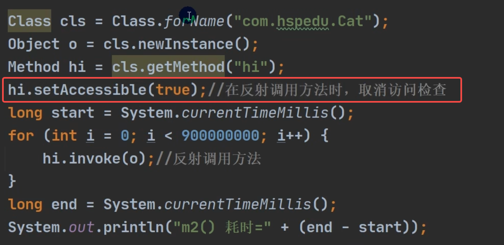

# 【7】 反射

# 概念
反射就是把 Java 类中的各个成分映射成一个个的 Java 对象。

即在运行状态中，对于任意一个类，都能够知道这个类所有的属性和方法，对于任意一个对象，都能调用它的任意一个方法和属性。

这种动态获取信息及动态调用对象方法的功能叫 Java 的反射机制。

简而言之，我们可以通过反射机制，获取到类的一些属性，包括类里面有哪些字段，有哪些方法，继承自哪个类，甚至还能获取到泛型，它的权限非常高，慎重使用。

:::color3
**什么是反射 ？**

+ JAVA 反射机制是在运行状态中，对于任意一个类，都能够知道这个类的所有属性和方法；
+ 对于任意一个对象，都能够调用它的任意一个方法和属性；
+ 这种动态获取的信息以及动态调用对象的方法的功能称为 Java 语言的反射机制。

:::

:::color3
1. 反射机制允许程序在执行期借助于 Reflection API 取得任何类的内部信息（比如成员变量，构造器，成员方法等等），并能操作对象的属性及方法。反射在设计模式和框架底层都会用到。
2. 加载完类之后，在堆中就产生了一个 Class 类型的对象（一个类只有一个 Class 对象），这个对象包含了类的**完整结构信息**。通过这个对象得到类的结构。这个对象就像一面镜子，透过这个镜子看到类的结构，所以。形象的称之为：反射。

----- 韩顺平

:::

# 类加载机制


了解一下类的加载机制，一个类是如何被加载和使用的，有助于理解反射机制的实现：

在 Java 程序启动时，JVM 会将一部分类（class 文件）先加载（并不是所有的类都会在一开始加载），通过ClassLoader 将类加载，在加载过程中，会将类的信息提取出来（存放在元空间中，JDK 1.8 之前存放在永久代），同时也会生成一个 Class 对象存放在内存（堆内存），注意此 Class 对象只会存在一个，与加载的类唯一对应！

**思考：**既然说和与加载的类唯一对应，那如果我们手动创建一个与 JDK 包名一样，同时类名也保持一致，那么JVM 会加载这个类吗？

```java
package java.lang;

public class String {    //JDK提供的String类也是
    public static void main(String[] args) {
        System.out.println("我姓s，我叫syt");
    }
}
```

我们发现，会出现以下报错：

```java
错误: 在类 java.lang.String 中找不到 main 方法, 请将 main 方法定义为:
   public static void main(String[] args)
```

但是我们明明在自己写的 String 类中定义了 main 方法啊，为什么会找不到此方法呢？实际上这是 ClassLoader的双亲委派机制在保护 Java 程序的正常运行：


实际上我们的类最开始是由 BootstarpClassLoader 进行加载，BootstarpClassLoader 用于加载 JDK 提供的类，而我们自己编写的类实际上是 AppClassLoader，只有 BootstarpClassLoader 都没有加载的类，才会让AppClassLoader 来加载，因此我们自己编写的同名包同名类不会被加载，而实际要去启动的是真正的 String 类，也就自然找不到 main 方法了！

```java
public class Main {
    public static void main(String[] args) {
        System.out.println(Main.class.getClassLoader());   //查看当前类的类加载器
        System.out.println(Main.class.getClassLoader().getParent());  //父加载器
        System.out.println(Main.class.getClassLoader().getParent().getParent());  //爷爷加载器
        System.out.println(String.class.getClassLoader());   //String类的加载器
    }
}
```

由于 BootstarpClassLoader 是 C++ 编写的，我们在 Java 中是获取不到的。


# 反射的使用
在 `Java` 中，`Class` 类与 `java.lang.reflect` 类库一起对反射技术进行了全力的支持。

在反射包中，我们常用的类主要有 `Constructor` 类，表示的是 `Class` 对象所表示的类的构造方法，利用它可以在运行时动态创建对象，`Field` 表示 `Class`对象所表示的类的成员变量，通过它可以在运行时动态修改成员变量的属性值(包含 `private`)、`Method` 表示 `Class`对象所表示的类的成员方法，通过它可以动态调用对象的方法(包含 `private`)。

+ `Class` 类对象的获取：

```java
@Test
public void classTest() throws Exception {
    // 获取 Class 对象的三种方式
    logger.info("根据类名:  \t" + User.class);
    logger.info("根据对象:  \t" + new User().getClass());
    logger.info("根据全限定类名:\t" + Class.forName("com.test.User"));
    // 常用的方法
    logger.info("获取全限定类名:\t" + userClass.getName());
    logger.info("获取类名:\t" + userClass.getSimpleName());
    logger.info("实例化:\t" + userClass.newInstance());
}
```

# 反射的优缺点
## 优点
可以动态的创建和使用对象（框架底层核心），使用灵活，没有反射机制，框架技术就失去底层支撑。

## 缺点
反射是解释执行，对速度有影响。

```java
public static void main(String[] args) throws ClassNotFoundException, InvocationTargetException, InstantiationException, IllegalAccessException, NoSuchMethodException {
        m1();
        m2();
    }
    // 传统方法
    public static void m1(){
        Cat cat = new Cat();
        long start = System.currentTimeMillis();
        for (int i = 0; i < 90000000; i++) {
            orderProcessMediaVO.hi();
        }
        long end = System.currentTimeMillis();
        System.out.println("m1 传统方法耗时：" + (end - start) + "ms");
    }


    public static void m2() throws ClassNotFoundException, InstantiationException, IllegalAccessException, NoSuchMethodException, InvocationTargetException {
        Class<?> cls = Class.forName("com.xxx.cat");
        Object o = cls.newInstance();
        Method hi = cls.getMethod("hi");
        long start = System.currentTimeMillis();
        for (int i = 0; i < 90000000; i++) {
            hi.invoke(o); //反射调用
        }
        long end = System.currentTimeMillis();
        System.out.println(" m2 传统方法耗时：" + (end - start) + "ms");
    }
```


## 反射调用优化
1. Method和Field、Constructor对象都有setAccessible()方法；
2. setAccessible作用是启动和禁用访问安全检查的开关；
3. 参数值为true表示反射的对象在使用时取消访问检查,提高反射的效率，参数值为false则表示反射的对象执行访问检查

所以关掉。




> 更新: 2024-04-16 15:44:13  
> 原文: <https://www.yuque.com/xiaoshan_wgo/codingnotes/gipi3w4opiwlv2ho>