# 并发多线程

#  多线程三种实现方式
## 实现多线程方式一：继承Thread类
+  方法介绍 

| 方法名 | 说明 |
| --- | --- |
| void run() | 在线程开启后，此方法将被调用执行 |
| void start() | 使此线程开始执行，Java虚拟机会调用run方法() |


+  实现步骤 
    - 定义一个类MyThread继承Thread类
    - 在MyThread类中重写run()方法
    - 创建MyThread类的对象
    - 启动线程
+  代码演示 

```java

// MyThreadDemo.java
public class MyThreadDemo {
    public static void main(String[] args) {
        MyThread my1 = new MyThread();
        MyThread my2 = new MyThread();

        my1.start();
        my2.start();
    }
}

class MyThread extends Thread {
    @Override
    public void run() {
        for(int i=0; i<100; i++) {
            System.out.println(i);
        }
    }
}
```

## 实现多线程方式二：实现Runnable接口
+  Thread构造方法 

| 方法名 | 说明 |
| --- | --- |
| Thread(Runnable target) | 分配一个新的Thread对象 |
| Thread(Runnable target, String name) | 分配一个新的Thread对象 |


+  实现步骤 
    - 定义一个类MyRunnable实现Runnable接口
    - 在MyRunnable类中重写run()方法
    - 创建MyRunnable类的对象
    - 创建Thread类的对象，把MyRunnable对象作为构造方法的参数
    - 启动线程
+  代码演示 

```java
class MyRunnable implements Runnable {
    @Override
    public void run() {
        for(int i=0; i<100; i++) {
            System.out.println(Thread.currentThread().getName()+":"+i);
        }
    }
}

public class MyRunnableDemo {
    public static void main(String[] args) {
        // 创建MyRunnable类的对象
        MyRunnable my = new MyRunnable();

        // 创建Thread类的对象，把MyRunnable对象作为构造方法的参数
        // Thread(Runnable target)
        // Thread t1 = new Thread(my);
        // Thread t2 = new Thread(my);
        // Thread(Runnable target, String name)
        Thread t1 = new Thread(my, "坦克");
        Thread t2 = new Thread(my, "飞机");

        // 启动线程
        t1.start();
        t2.start();
    }
}
```

## 实现多线程方式三: 实现Callable接口【应用】
+  方法介绍 

| 方法名 | 说明 |
| --- | --- |
| V call() | 计算结果，如果无法计算结果，则抛出一个异常 |
| FutureTask(Callable callable) | 创建一个 FutureTask，一旦运行就执行给定的 Callable |
| V get() | 如有必要，等待计算完成，然后获取其结果 |


+  实现步骤 
    - 定义一个类MyCallable实现Callable接口
    - 在MyCallable类中重写call()方法
    - 创建MyCallable类的对象
    - 创建Future的实现类FutureTask对象，把MyCallable对象作为构造方法的参数
    - 创建Thread类的对象，把FutureTask对象作为构造方法的参数
    - 启动线程
    - 再调用get方法，就可以获取线程结束之后的结果。
+  代码演示 

```java
public class MyCallable implements Callable<String> {
    @Override
    public String call() throws Exception {
        for (int i = 0; i < 100; i++) {
            System.out.println("跟女孩表白" + i);
        }
        //返回值就表示线程运行完毕之后的结果
        return "答应";
    }
}
public class Demo {
    public static void main(String[] args) throws ExecutionException, InterruptedException {
        //线程开启之后需要执行里面的call方法
        MyCallable mc = new MyCallable();

        //Thread t1 = new Thread(mc);

        //可以获取线程执行完毕之后的结果.也可以作为参数传递给Thread对象
        FutureTask<String> ft = new FutureTask<>(mc);

        //创建线程对象
        Thread t1 = new Thread(ft);

        //String s = ft.get(); get不能在开启线程之前，否则会阻塞在这里
        //开启线程
        t1.start();

        String s = ft.get();
        System.out.println(s);
    }
}
```

## 三种实现方式的对比 
+ 实现Runnable、Callable接口 
    - 好处: 扩展性强，实现该接口的同时还可以继承其他的类
    - 缺点: 编程相对复杂，不能直接使用Thread类中的方法
+ 继承Thread类 
    - 好处: 编程比较简单，可以直接使用Thread类中的方法
    - 缺点: 可以扩展性较差，不能再继承其他的类

# 常见成员方法
## 设置和获取线程名称
+  方法介绍 

| **方法名** | **说明** |
| --- | --- |
| void  setName(String name) | 将此线程的名称更改为等于参数name |
| String  getName() | 返回此线程的名称 |
| static Thread  currentThread() | 返回对当前正在执行的线程对象的引用 |


:::color3
细节：

+ 如果没有给线程设置名字，线程也是有默认的名字的，Thread-X【序号】

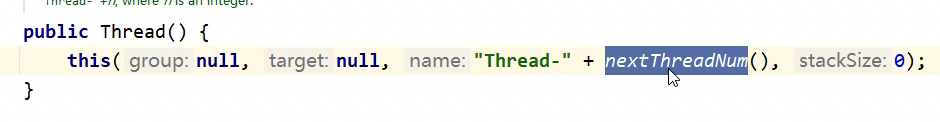 

:::

+  代码演示 

```java
public class MyThread extends Thread {
    public MyThread() {}
    public MyThread(String name) {
        super(name);
    }

    @Override
    public void run() {
        for (int i = 0; i < 100; i++) {
            System.out.println(getName()+":"+i);
        }
    }
}
public class MyThreadDemo {
    public static void main(String[] args) {
        MyThread my1 = new MyThread();
        MyThread my2 = new MyThread();

        //void setName(String name)：将此线程的名称更改为等于参数 name
        my1.setName("高铁");
        my2.setName("飞机");

        //Thread(String name)
        MyThread my1 = new MyThread("高铁");
        MyThread my2 = new MyThread("飞机");

        my1.start();
        my2.start();

        //static Thread currentThread() 返回对当前正在执行的线程对象的引用
        System.out.println(Thread.currentThread().getName()); // main
    }
}
```

:::color3
<font style="color:rgb(44, 44, 54);">最后一行代码是在 main 方法中执行的，而在Java程序中，main 方法是程序的起点，它默认是运行在一个名为 "main" 的线程中的。因此，Thread.currentThread().getName() 在这里会输出 "main"，表示这是主线程。</font>

:::

## 线程休眠
+  相关方法 

| **方法名** | **说明** |
| --- | --- |
| static void sleep(long millis) | 使当前正在执行的线程停留（暂停执行）指定的毫秒数 |


:::color3
细节：

+ 那条线程执行到 sleep 这条线程就会在这里停留
+ 方法的参数是毫秒
+ 当时间到了之后，线程会自动的醒来，继续执行下面的方法

:::

+ 代码演示 

```java
class MyRunnable implements Runnable {
    @Override
    public void run() {
        for (int i = 0; i < 100; i++) {
            try {
                Thread.sleep(100);
            } catch (InterruptedException e) {
                e.printStackTrace();
            }

            System.out.println(Thread.currentThread().getName() + "---" + i);
        }
    }
}
public class Demo {
    public static void main(String[] args) throws InterruptedException {
        /*System.out.println("睡觉前");
        Thread.sleep(3000);
        System.out.println("睡醒了");*/

        MyRunnable mr = new MyRunnable();

        Thread t1 = new Thread(mr);
        Thread t2 = new Thread(mr);

        t1.start();
        t2.start();
    }
}
```

## 线程优先级
+  线程调度 
    -  两种调度方式 
        * 分时调度模型：所有线程轮流使用 CPU 的使用权，平均分配每个线程占用 CPU 的时间片
        * 抢占式调度模型：优先让优先级高的线程使用 CPU，如果线程的优先级相同，那么会随机选择一个，优先级高的线程获取的 CPU 时间片相对多一些
+ Java 使用的是抢占式调度模型 
    - 抢占式具备**随机性**
    - 假如计算机只有一个 CPU，那么 CPU 在某一个时刻只能执行一条指令，线程只有得到CPU时间片，也就是使用权，才可以执行指令。所以说多线程程序的执行是有随机性，因为谁抢到CPU的使用权是不一定的
    - 优先级默认是5

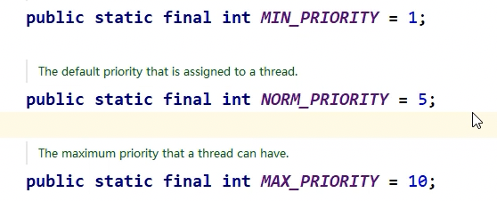

+  优先级相关方法 

| **方法名** | **说明** |
| --- | --- |
| final int getPriority() | 返回此线程的优先级 |
| final void setPriority(int newPriority) | 更改此线程的优先级线程默认优先级是5；线程优先级的范围是：1-10 |


+  代码演示 

```java
public class MyCallable implements Callable<String> {
    @Override
    public String call() throws Exception {
        for (int i = 0; i < 100; i++) {
            System.out.println(Thread.currentThread().getName() + "---" + i);
        }
        return "线程执行完毕了";
    }
}
public class Demo {
    public static void main(String[] args) {
        //优先级: 1 - 10 默认值:5
        MyCallable mc = new MyCallable();

        FutureTask<String> ft = new FutureTask<>(mc);

        Thread t1 = new Thread(ft);
        t1.setName("飞机");
        t1.setPriority(10);
        //System.out.println(t1.getPriority());//5
        t1.start();

        MyCallable mc2 = new MyCallable();

        FutureTask<String> ft2 = new FutureTask<>(mc2);

        Thread t2 = new Thread(ft2);
        t2.setName("坦克");
        t2.setPriority(1);
        //System.out.println(t2.getPriority());//5
        t2.start();
    }
}
```

## 守护线程
+  相关方法 

| **方法名** | **说明** |
| --- | --- |
| void setDaemon(boolean on)  | 将此线程标记为守护线程，当运行的线程都是守护线程时，Java虚拟机将退出 |


+ 当其他的非守护线程执行完毕了之后，守护线程就陆陆续续的结束了。 


+ 当聊天窗口（非守护线程）关了，传输文件（守护线程）也被关掉的。
+ 代码演示 

```java
public class MyThread1 extends Thread {
    @Override
    public void run() {
        for (int i = 0; i < 10; i++) {
            System.out.println(getName() + "---" + i);
        }
    }
}
public class MyThread2 extends Thread {
    @Override
    public void run() {
        for (int i = 0; i < 100; i++) {
            System.out.println(getName() + "---" + i);
        }
    }
}
public class Demo {
    public static void main(String[] args) {
        MyThread1 t1 = new MyThread1();
        MyThread2 t2 = new MyThread2();

        t1.setName("线程1");
        t2.setName("线程2");

        //把第二个线程设置为守护线程
        //当普通线程执行完之后,那么守护线程也没有继续运行下去的必要了.
        t2.setDaemon(true);

        t1.start();
        t2.start();
    }
}
```

## 礼让线程（了解）
| **方法名** | **说明** |
| --- | --- |
| static void yield | 出让线程/礼让线程，让出当前CPU的执行权 |


:::color3
这个方法只是尽可能的会让结果均匀一些。

:::

```java
public class ThreadDemo{
    public static void main(String[] args){
        MyTread t1  = new MyThread();
        MyTread t2  = new MyThread();        
        t1.setName("线程1");
        t2.setName("线程2");

        t1.start();
        t2.start();
    }
}
```

```java
public class MyTread extends Thread{
    @Override
    public void run(){
        for(int i =1;i<100;i++){
            SyStem.out.println(getName + "@" + i);
        }
        // 表示出让当前 CPU 的执行权
        Thread.yield();
    }
}
```

## 插入线程（了解）
| **方法名** | **说明** |
| --- | --- |
| final void join | 插入线程/插队线程 |


:::color3
这个方法只是尽可能的会让结果均匀一些。

:::

```java
public class ThreadDemo{
    public static void main(String[] args){
        MyTread t = new MyTread();
        t.setName("土豆");
        t.start();

        // 表示把t这个线程插入到当前线程之前
        // t:土豆
        // 当前线程：main
        t.join();
        
        //执行在main线程当中的
        for(int i =0;i<10;i++){
            Sout("main线程" + i);
        }
    }
}
```

```java
public class MyTread extends Thread{
    @Override
    public void run(){
        for(int i =1;i<100;i++){
            SyStem.out.println(getName + "@" + i);
        }
    }
}
```

# 线程的生命周期
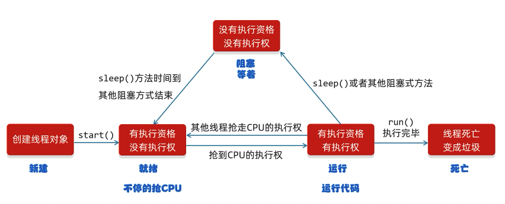

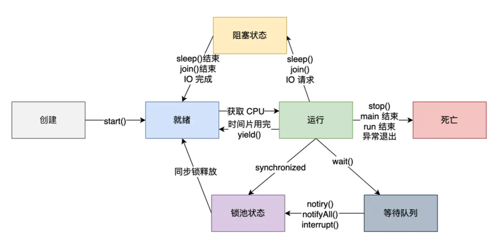

# 线程同步问题
当多个线程操作同一个数据的时候会一些出现问题，比如：

+ 可能会超出范围
+ 相同的数据被访问了多次

假设这三条线程，都在跑下述的代码：

```java
while(true){
    if(ticket < 100){
        try {
            Tread.sleep(10);
        }catch(InterruptedException e){
            e.printStackTrace();
        }
        ticket++;
        sout("在卖第"+ ticket + "张票!");
    }else{
        break;
    }
}
```

假设线程1执行了ticket 99 自增变成了100，还没来得及打印，线程2 就开始ticket++ 就变成了101，所以这样的情况，就超出范围了。

假设线程1，抢到了执行权，这个时候 线程1 睡觉 10 毫秒，然后 线程2 抢到了，线程2 开始睡 10 毫秒，这个时‘候线程3 就会进来，睡 10 毫秒，然后这三条会陆陆续续的醒来。后面继续假设，线程1醒来了，执行 ticket++，0 变成了 1，但是还没来得及打印呢，执行权被线程2抢走了，这个时候线程2的 ticket 可能也是1。这样就会发生相同的数据被访问了多次的情况。

造成问题的核心原因：

+ 线程执行时候，具有随机性

解决方案：

+ 给操作的这段代码给锁起来，其他的线程就算抢夺到了执行权也得等着。让他们执行线程。

```java
synchronized（锁）{
    操作共享数据的代码
}
```

锁有几个特点：

+ 锁默认打开，有一个线程进去了，锁自动关闭
+ 里面的代码全部执行完毕，线程出来，锁自动打开

```java
// 随便一个锁对象
static Object obj = new Object();


while(true){
    // 同步代码块
    synchronized(obj){
        if(ticket < 100){
            try {
                Tread.sleep(10);
            }catch(InterruptedException e){
                e.printStackTrace();
            }
            ticket++;
            sout("在卖第"+ ticket + "张票!");
        }else{
            break;
        }
    }
}
```

:::color3
细节：

1. synchronized不能写在循环的外面，不然就指定了一个线程去循环了。
2. 如果synchronized的锁对象不唯一，那这个锁就毫无意义。
    1. 比如锁设置为 this 就会非同步，因为 this 代表当前执行的线程，这会导致不同的线程使用不同的锁
    2. 可以用 当前类的字节码文件，`类名.class` 当成锁，这个对象能确保是唯一的，例如下面的代码

:::

```java
// 表示这个类的所有的对象，都共享ticket数据
static int ticket = 0;

while(true){
    // 同步代码块
    synchronized(MyThread.class){
        if(ticket < 100){
            try {
                Tread.sleep(10);
            }catch(InterruptedException e){
                e.printStackTrace();
            }
            ticket++;
            sout("在卖第"+ ticket + "张票!");
        }else{
            break;
        }
    }
}
```

加上锁的部分，所以这个时候线程的生命周期变成了：


# 同步方法
可以把synchronized关键字加到方法上。

## 同步方法两个特点
1. 同步方法是所属方法里面的所有的代码
2. 锁对象不能自己制定

```java
修饰符 synchronized 返回值类型 方法名（方法参数) {...}
```

非静态：this

静态：类字节码文件

举个例子：

```java
public class MyRunnable implements Runnable{
    // 使用 Runnable 创建的就不需要 static 了，因为 Runnable，这个ticket会被多次调用，始终都是固定的值
    int ticket = 0;
    @Override
    public void run(){
        // 1. 循环
        // 2.同步代码块（同步方法）
        // 3.判断共享数据是否到了末尾，如果到了末尾
        // 4.判断共享数据是否到了末尾，如果没到末尾

        while(true){
            synchronized(MyRunnable.class){
                if(ticket == 100){
                    break;
                }else{
                    try {
                        Thread.sleep(10)
                    }catch(InterruptedException){
                        e.printStackTrace();
                    }
                    ticket ++;
                    sout(Thread.getName() + ticket);
                }

            }
        }
    }
}
```

```java
public static void main(){
    MyRunnable mr = new MyRunnable();
    // 开启三个线程
}
```

把上面的同步代码块，放到同步方法中：

选中代码块，按下 IDEA 中 ctrl alt + M 就可以快速，抽出方法。

```java
public class MyRunnable implements Runnable{
    // 使用 Runnable 创建的就不需要 static 了，因为 Runnable，这个ticket会被多次调用，始终都是固定的值
    int ticket = 0;
    @Override
    public void run(){
        // 1. 循环
        // 2.同步代码块（同步方法）
        // 3.判断共享数据是否到了末尾，如果到了末尾
        // 4.判断共享数据是否到了末尾，如果没到末尾

        while(true){
            synchronized(MyRunnable.class){
                if(method()) break;
            }
        }
    }
    private synchronized boolean method(){
        if(ticket == 100){
            return true;
        }else{
            ticket ++;
            sout(Thread.getName() + ticket);
        }
        return false;
    }

}
```

## StringBuilder 和 StringBuffer
拼接字符串的时候经常会使用这两个方法？那这两个方法有什么区别呢？

StringBuilder是线程不安全的，如果需要同步，建议使用 StringBuffer。

观察远吗 发现 StringBuffer 所有的方法上都有 synchronized 。

如果代码是单线程的，使用 StringBuilder 就行。

# Lock 锁
前面的例子用的都是自动的锁，JDK 5 之后提供了一个新的锁对象 Lock。

虽然我们可以理解同步代码块和同步方法的锁对象的问题，

但是并没有直接看到哪里上了锁，在哪里释放了锁，

为了更清晰的表达如何加锁和释放锁，JDK5以后提供了一个新的锁对象Lock。

Lock 实现提供比使用 synchronized 方法和语句可以获得更广泛的锁定操作。

Lock 中提供了获得锁和释放锁的方法：

+ void lock()：获得锁
+ void lock()：释放锁

Lock 是接口不能直接实例化，这里采用它的的实现类 ReentrantLock 来实例化 ReentrantLock 的构造方法。

ReentrantLock():创建一个 ReentrantLock 的实例。

```java
public class MyRunnable implements Runnable{
    // 使用 Runnable 创建的就不需要 static 了，因为 Runnable，这个ticket会被多次调用，始终都是固定的值
    int ticket = 0;
    Lock lock = new ReentrantLock();
    @Override
    public void run(){
        // 1. 循环
        // 2.同步代码块（同步方法）
        // 3.判断共享数据是否到了末尾，如果到了末尾
        // 4.判断共享数据是否到了末尾，如果没到末尾
        while(true){
            // synchronized(MyRunnable.class){
            lock.lock():
                if(ticket == 100){
                    break;
                }else{
                    try {
                        Thread.sleep(10)
                    }catch(InterruptedException){
                        e.printStackTrace();
                    }
                    ticket ++;
                    sout(Thread.getName() + ticket);
                }
            lock.unlock();
            //}
        }
    }
}
```

假设 线程1 一直在循环里面执行，当线程1执行到最后一次 ticket = 100，这个时候直接 break，但是我的锁还没有解锁。这个时候我的 线程2 和线程3都在等待，所以当下的时候我的锁没有停止，这个时候在break前面加上lock.unlock()也可以，但是lock.unlock()是一个扫尾的代码，所以为了简化，我们可以写在 finnally 里面，如下

```java
public class MyRunnable implements Runnable{
    // 使用 Runnable 创建的就不需要 static 了，因为 Runnable，这个ticket会被多次调用，始终都是固定的值
    int ticket = 0;
    Lock lock = new ReentrantLock();
    @Override
    public void run(){
        // 1. 循环
        // 2.同步代码块（同步方法）
        // 3.判断共享数据是否到了末尾，如果到了末尾
        // 4.判断共享数据是否到了末尾，如果没到末尾
        while(true){
            // synchronized(MyRunnable.class){
            lock.lock():
            try{    
            if(ticket == 100){
                    break;
                }else{
                    try {
                        Thread.sleep(10)
                    }catch(InterruptedException){
                        e.printStackTrace();
                    }
                    ticket ++;
                    sout(Thread.getName() + ticket);
                }
            }catch(InterruptedException e){
                e.printStackTrace();
            }finally{
                lock.unlock();
            }
            lock.unlock();
            //}
        }
    }
}
```

死锁错误：假设线程a，和线程b。两个不一样的锁，都在等着对方释放锁，这个时候程序就会卡死。


# 生产者和消费者
## 普通的等待唤醒机制


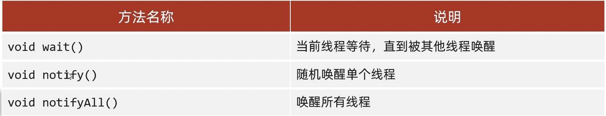


```java
public class Desk{
    /**
    * 作用：控制生产者和消费者的执行
    **/
    // 是否有面条 0:没有面条 1:有面条
    public static int foodFlag = 0;

    // 总个数
    public static int count = 10;

    //锁对象
    public static Object lock = new Object();
    
}
```

```java
public class Foodie extends Thread{
    @Override
    public void run(){
        // 1. 循环
        // 2. 同步代码块（同步方法）
        // 3. 判断共享数据是否到了末尾（到了末尾）
        // 4. 判断共享数据是否到了末尾（没有到末尾，执行核心逻辑）
        while(true){
            synchronized(Desk.lock){
                if(Desk.conut==0){
                    break;
                }else{
                    // 先去判断桌子上是否有吃的
                    if(Desk.foodFlag == 0){
                        // 没有就等待
                        try{
                            Desk.lock.wait(); //让当前线程和锁绑定
                           }catch(InterruptedException e){
                            e.printStackTrace();
                        }
                    }else{
                        // 把吃的总数 -1
                        Desk.count--;
                        sout(吃,还能吃"+Desk.count+"碗");
                        // 吃完之后，唤醒厨师继续做
                        Desk.lock.notifyAll();
                        // 修改桌子的状态
                        Desk.foodFlag = 0;
                    }
                }
            }
        }
    }
}
```

```java
public class Cook extends Thread{
    @Override
    public void run(){
        // 1. 循环
        // 2. 同步代码块（同步方法）
        // 3. 判断共享数据是否到了末尾（到了末尾）
        // 4. 判断共享数据是否到了末尾（没有到末尾，执行核心逻辑）
        while(true){
            synchronized(Desk.lock){
                if(Desk.conut == 0){
                    break;
                }else{
                    // 判断桌子上是否有食物
                    if(Desk.foodFlag==1){
                        // 如果有，就等待
                        try{
                            Desk.lock.wait();
                        }catch(InterruptedException e){
                            e.printStackTrace();
                        }
                    }else{
                        // 如果没有，就制作食物
                        Desk.count++;
                        sout("做了一碗食物");
                        // 修改桌子上的食物状态
                        Desk.foodFlag == 1;
                        // 叫醒消费者
                        Desk.lock.notifyAll();
                    }
                }
            }
        }
    }
}
```

```java
public class ThreadDemo{
    main{
        Cook c = new Cook();
        Foodie f = new Foodie();
        c.setName("厨师");
        f.setName("吃货");
        c.start();
        f.start();
    }
}
```

## 引入阻塞队列


请注意：生产者和消费者必须使用同一个阻塞队列。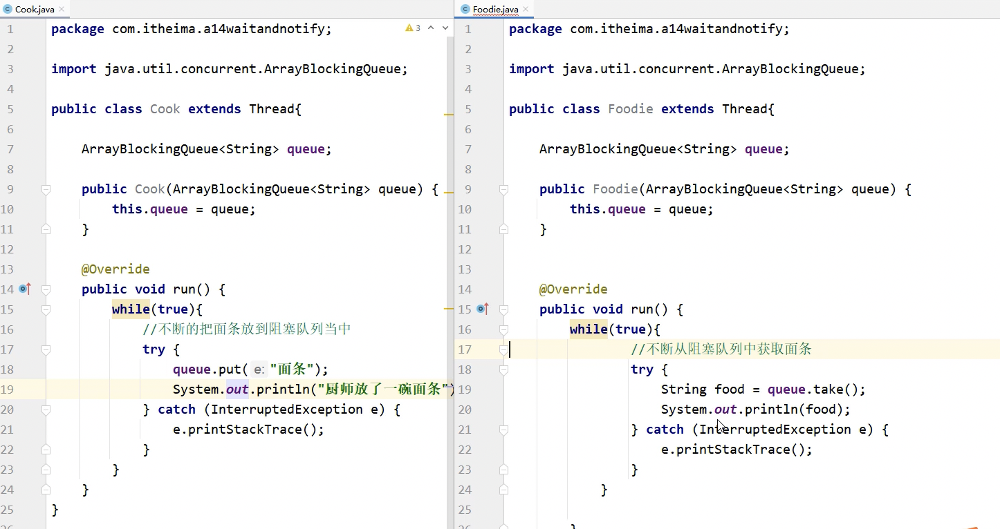


上述的有个细节，打印的语句定义在了锁的外面，所以有时候打印的顺序是乱的。

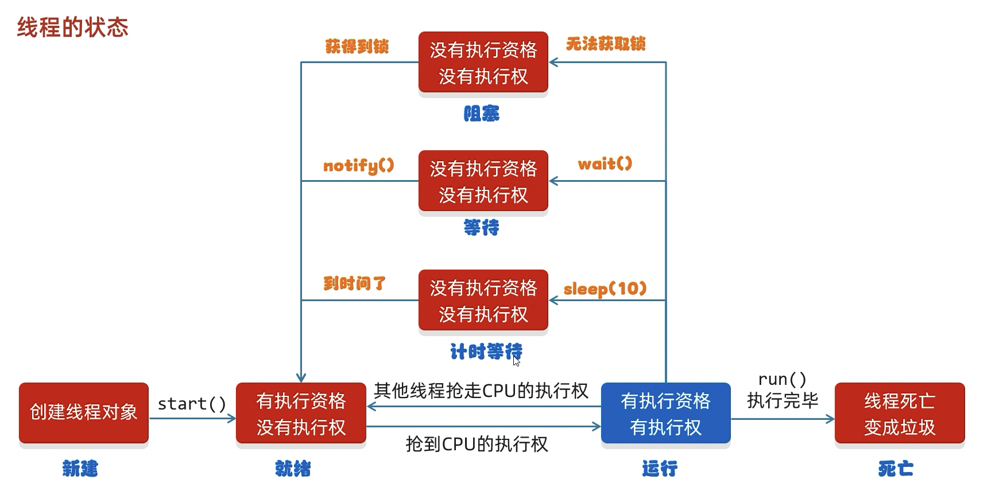

在java虚拟机当中，只有当前状态，没有定义运行中的状态。

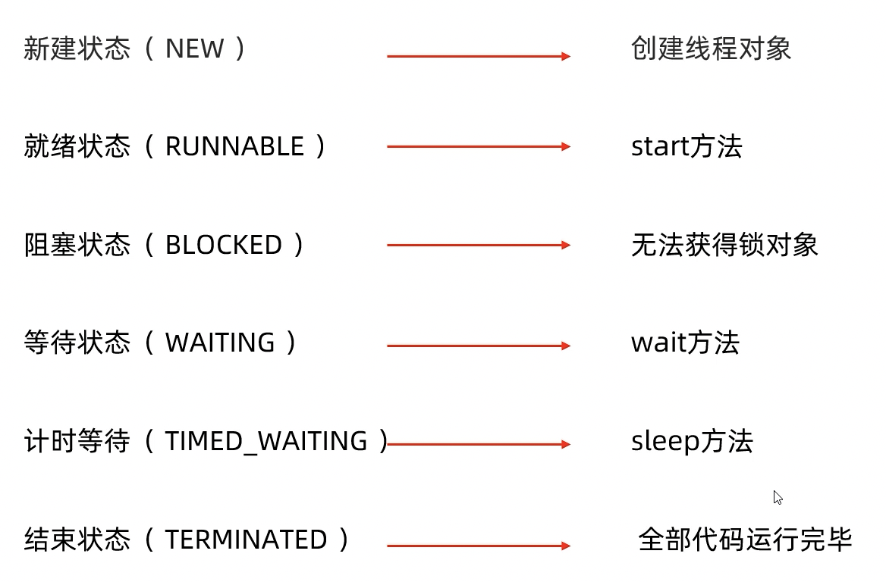


# 线程池
线程池的实现思路：

1. 创建一个池子，池子是空的；
    1. Executors，线程池的工具类通过调用方法返回不同类型的线程池对象。

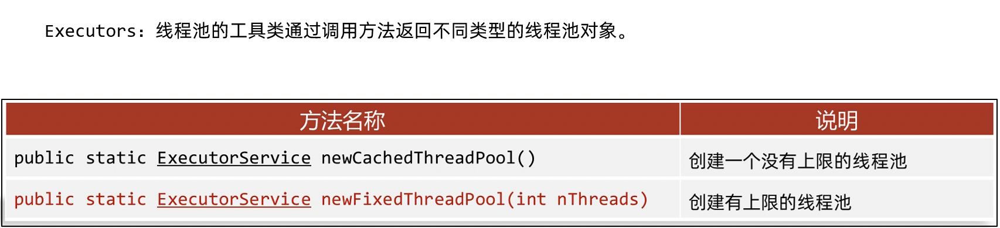

2. 提交任务时，池子会创建新的线程对象，任务执行完毕，线程归还给池子。下回再次提交任务的时候，不需要创建新的线程，直接复用已有的线程即可；
3. 但是如果提交任务时候，池子中没有空闲线程，也无法创建新的线程， 任务就会排队等待。

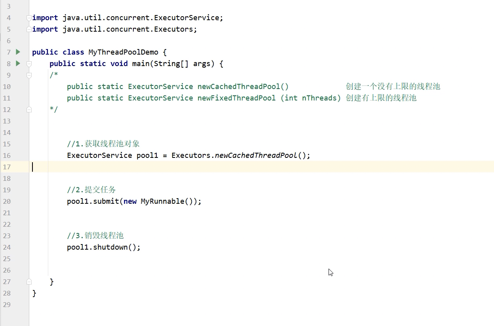

一般来说，线程池是不会被销毁的。

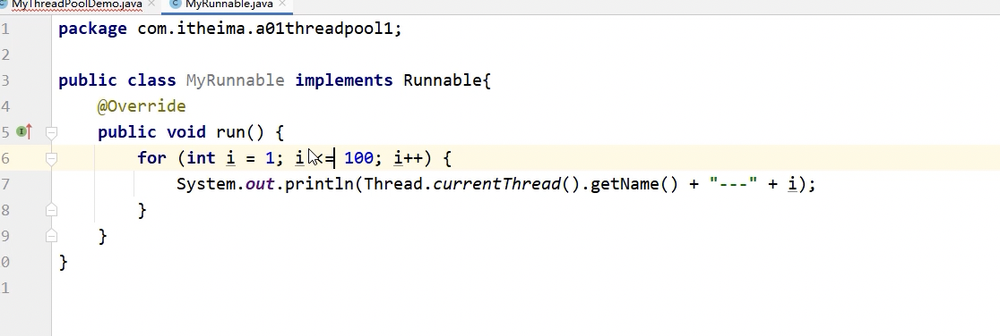

```java
public static void main(String[] args) {
    ExecutorService executorService = new ThreadPoolExecutor(3, 5, 1L, TimeUnit.SECONDS, new LinkedBlockingDeque<>(3), Executors.defaultThreadFactory(), new ThreadPoolExecutor.AbortPolicy());
    for (int i = 0; i < 10; i++) {
        executorService.execute(()->{
            System.out.println(Thread.currentThread().getName()+"办理业务");
        });
    }
    executorService.shutdown();
}
```

结果就是五个线程办理业务。当i<=3的时候，123个线程分别处理123，然后我因为LinkedBlockingDeque的大小可以等待3个人，所以当i<=6的时候，我仍旧是123三个线程来处理，当7以上的时候，就可能要让线程45开始工作了，因为没有可以等待的业务了。

```java
pool-1-thread-1办理业务
pool-1-thread-1办理业务
pool-1-thread-1办理业务
pool-1-thread-2办理业务
pool-1-thread-4办理业务
pool-1-thread-4办理业务
pool-1-thread-5办理业务
pool-1-thread-3办理业务
pool-1-thread-2办理业务
pool-1-thread-1办理业务
```

```java
public ThreadPoolExecutor(int corePoolSize,
                          int maximumPoolSize,
                          long keepAliveTime,
                          TimeUnit unit,
                          BlockingQueue<Runnable> workQueue,
                          ThreadFactory threadFactory,
                          RejectedExecutionHandler handler) {
    if (corePoolSize < 0 ||
        maximumPoolSize <= 0 ||
        maximumPoolSize < corePoolSize ||
        keepAliveTime < 0)
        throw new IllegalArgumentException();
    if (workQueue == null || threadFactory == null || handler == null)
        throw new NullPointerException();
    this.acc = System.getSecurityManager() == null ?
            null :
            AccessController.getContext();
    this.corePoolSize = corePoolSize;
    this.maximumPoolSize = maximumPoolSize;
    this.workQueue = workQueue;
    this.keepAliveTime = unit.toNanos(keepAliveTime);
    this.threadFactory = threadFactory;
    this.handler = handler;
}
```

# 自定义线程池
模拟饭店经营的场景，来自定义线程池，此类场景，有几大核心元素：

1. 正式员工数量
2. 餐厅最大员工数
3. 临时员工空闲多长时间被辞退的值
4. 临时员工空闲多长时间被辞退的单位
5. 排队的客户
6. 从哪里招人
7. 当饭店排队人数过多，超出的顾客请下次再来（拒绝服务）

上述对应的几个元素，对应的就是线程池的下面一个属性：

1. 核心线程数量
2. 线程池中最大线程的数量
3. 空闲时间（值）
4. 空闲时间（单位）
5. 阻塞队列
6. 创建线程的方式
7. 要执行的任务过多时的解决方案


> 更新: 2025-06-03 16:36:54  
> 原文: <https://www.yuque.com/xiaoshan_wgo/codingnotes/agb4y1ddw02l382t>