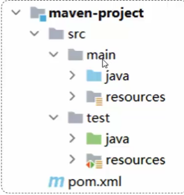
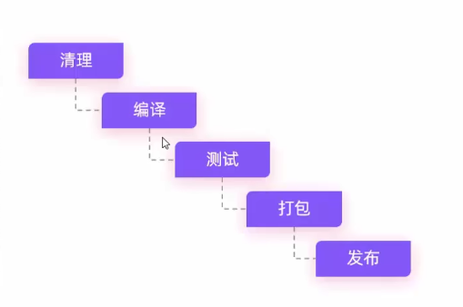
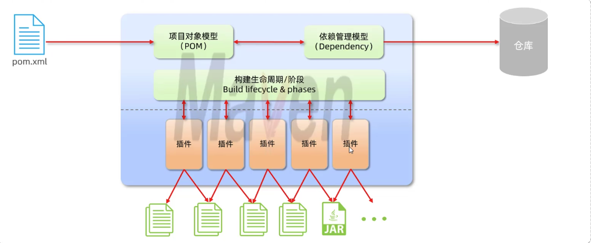
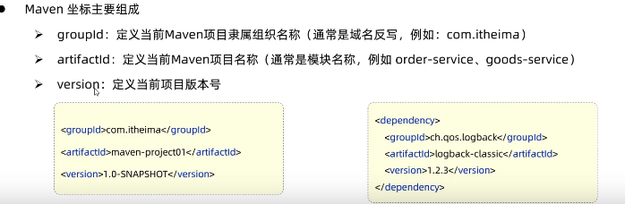
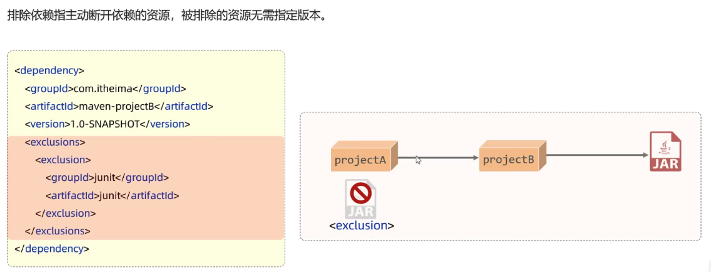
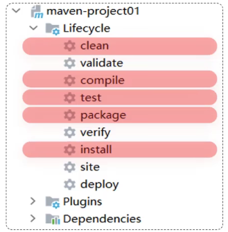

# Maven

# 作用
+ 依赖管理：快捷的管理项目依赖的资源，避免版本冲突问题。不需要下载对应版本的 jar 包。自动通过 maven 进行导入。用什么 jar 就在 pom.xml 进行更新。
+ 统一项目结构：不同IDE的工程结构不一样，使用maven构建的项目是一致且通用的。

# 详细介绍
·

# IDEA 集成 Maven
## 创建 maven 环境

## 创建 maven 项目
2022 以上 IDEA 版本，创建 Maven 是带模版的。

### maven 坐标

## 导入 maven 项目
导入 pom.xml。

# 依赖管理
+ 依赖管理
+ 依赖传递
+ 依赖范围
+ 生命周期

## 依赖管理
想要一个依赖可以去 mvn 仓库中，可以搜索这个依赖的版本和信息，直接复制加进去就可以了。

依赖本地不存在的话，就去远程仓库搜索，然后下载这个依赖。

## 依赖传递
依赖具备传递性。

A 依赖 B，则引入 A 的时候，B 也会被随之引入。

那么如何排除依赖呢？

使用 <exclusion> 排除：  

## 依赖范围
依赖的 jar 包，默认情况下，可以在任何地方使用。

通过<scope>...</scope>设置作用范围：

+ 主程序范围有效。（main 文件夹范围内）
+ 测试程序范围有效。（test文件夹范围内）
+ 是否参与打包运行。（package指令范围内）

# 生命周期
Maven 的生命周期就是为了对所有的 maven 项目构建过程进行抽象和统一。

Maven 中有 3 套相互独立的生命周期：

clean：清理工作；

default：核心工作，比如编译、测试、打包、安装、部署等。

site：生成报告、发布站点等。

主要关注以下五个阶段：

在同一套生命周期中，当运行后面的阶段时，前面的阶段都会运行。

install 属于 default，如果点击了 install，那么 clean 是不会运行的。所以要点击 clean，然后再点击 install。

> 更新: 2023-10-19 14:18:31  
> 原文: <https://www.yuque.com/xiaoshan_wgo/codingnotes/wo81zqz4m57lghbc>