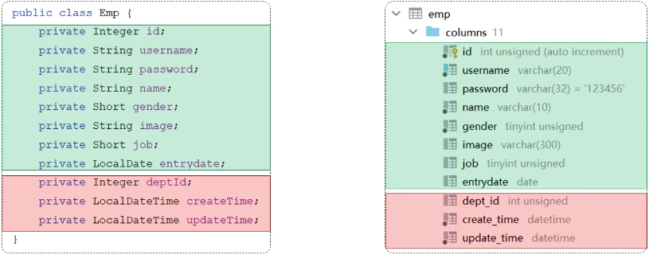
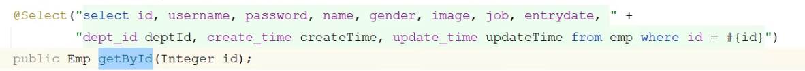
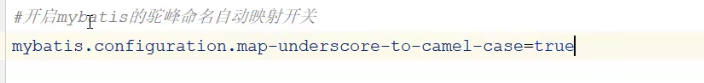
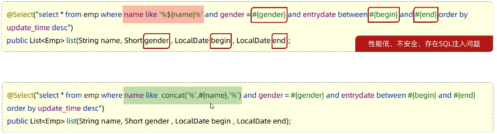
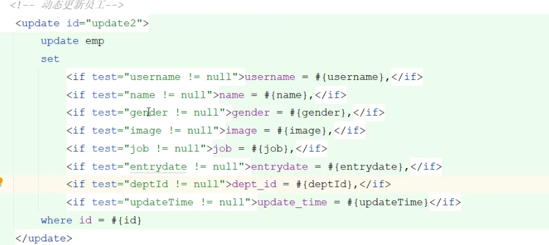
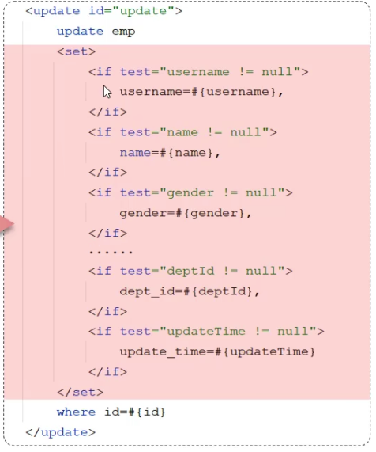
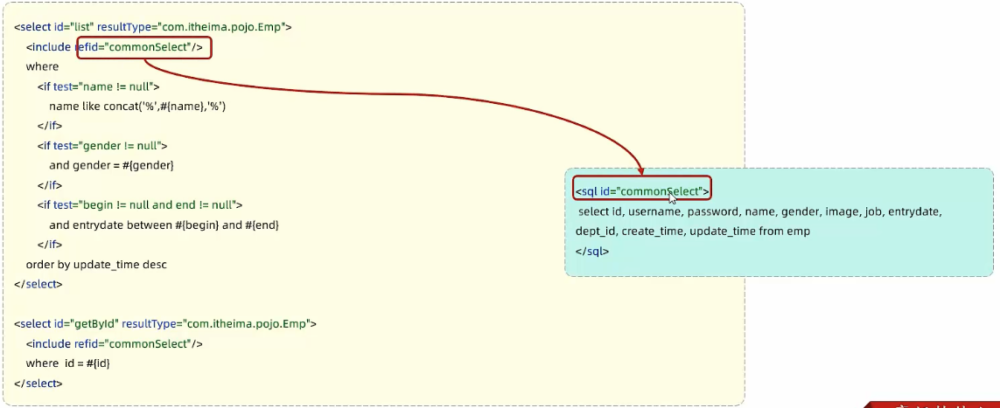

# MyBatis

# 增删查改 CRUD
## 删除
从 emp 表中删除员工信息。

1. **写 SQL 语句：删除主键 id = 17 的员工：**

```sql
delete from emp where id = 17;
```

2. **写 Mapper 接口：**

```java
@Mapper
public interface EmpMapper{
    @Delete("delete from emp where id = 17") //删除注解，里面写 SQL 语句
    public void delete(); 
}
```

3. **17 应该是用户传来的参数，把 17 替换掉：**

```java
@Mapper
public interface EmpMapper{
    @Delete("delete from emp where id = #{id}") //删除注解，里面写 SQL 语句
    public void delete(Integer id); 
}
```

4. **测试这个接口，实际上这个 id 是前端传来的数据：**

```java
@SpringBootTest
class SpringBootMybatisCrudApplicationTests{
    @Autowired
    private EmpMapper empMappper;
    public void testDelete(){
        empMapper.delete(id);
    }
}
```

5. **想要拿到返回值，知道到底操作了多少数据：**

```java
@Mapper
public interface EmpMapper{
    @Delete("delete from emp where id = #{id}") //删除注解，里面写 SQL 语句
    public int delete(Integer id); 
}
```

```java
@SpringBootTest
class SpringBootMybatisCrudApplicationTests{
    @Autowired
    private EmpMapper empMappper;
    public void testDelete(){
        int delete = empMapper.delete(id);
        System.out.println(delete);
    }
}
```

+ 返回值为 0，就是没有删除数据；
+ 返回值为 1，操作了 1 条数据；

:::info
注意：如果 mapper 接口方法形参只有一个普通类型的参数，#{...} 里面的属性名字可以随便写，如：  
#{id}、#{value}。

:::

6. **控制台输出日志信息**

```xml
#配置Mybatis日志信息
mybatis.configuration.log-impl=org.apache.ibatis.logging.stdout.StdOutImpl
```

```plain
--> Preparing:delete from emp where id = ?
==> Paramteters:16(Integer)
<== Updates:0
```

? 问号：参数占位符。会使用下面的参数，占用这个位置。

Updates = 0 意思是 0 行进行修改。

前两行被叫做“预编译 SQL”，好处是性能高，更安全。

性能高：是因为简化了 SQL 编译后的流程，放在缓存中，后面再查就快了。

更安全：可以防止 SQL 注入。

## 新增
1. **写插入 SQL 语句：**

```sql
insert into emp(username, name, gender,image,birth,create_time) 
	values(‘Tom’,'汤姆','男','1.jpg','2000-1-1',now());
```

2. **写 Mapper：**

```java
@Insert("insert into emp(username, name, gender,image,birth,create_time") 
values(‘Tom’,'汤姆','男','1.jpg','2000-1-1',now()))
public void insert();
```

3. **声明方法形参，封装成员工对象：**

```java
@Insert("insert into emp(username, name, gender,image,birth,create_time") 
values(#{username},#{name},#{gender},#{image},#{birth},#{createTime}"))
        public void insert(Emp emp);
```

4. **有些情况需要主键返回，在数据添加成功后，需要获取插入数据库数据的主键，供后续操作使用：**

```java
@Options(keyProperty="id",useGeneratedKeys=true)
@Insert("insert into emp(username, name, gender,image,birth,create_time") 
values(#{username},#{name},#{gender},#{image},#{birth},#{createTime}"))
        public void insert(Emp emp);

```

@Options(keyProperty="id",useGeneratedKeys=true) 这个注解会自动生成的主键值，赋值给 emp 对象的 id 属性。可以用于页面的回显展示。

## 更新
1. **写 SQL 语句**

```sql
update emp set username = '',name = '',gender = '', image = '',birth ='',update_time ='' where id = 1;
```

2. **在 mapper 中更新数据**

```java
@update("update emp set username = '',name = '',gender = '', image = '',birth ='',update_time ='' where id = 1'"
       )
public void update();
```

3. **封装对象**

```java
@update("update emp set username = #{username},name = #{name},gender = #{gender}, image = #{image},brith =#{birth},update_time =#{updateTime} where id = #{id}
")
public void update(Emp emp);
```

## 查询
### 基本查询
根据 id 查询员工

```java
@Select("select * emp where id = #{id}")
public Emp getById(Integer id);
```

有时候查询返回回来的一些字段为空，这是因为 mybatis 的自动封装机制：

+ **实体类属性名**和**数据库表查询返回的字段名**一致，mybatis 会自动封装。
+ 如果**实体类属性名**和**数据库表查询返回的字段名**不一致，不能自动封装。



解决方案 1 : 给字段起别名，让别名与实体类属性一致



解决方案 2: 使用注解 @Results @Value


**解决方案 3: 开启驼峰命名自动映射开关**



### 条件查询
1. **SQL 语句，根据员工的条件查询：**

姓张（模糊查询），性别男，更新时间倒序列出。

```sql
select * from emp where name like '%张%' and gender = 1 order by update_time desc;
```



### 分页查询
# XML 映射文件
:::info
**✏️**** 一些规范：**

+ XML 映射文件的名称和 Mapper 接口名称一致，并且 XML 映射文件和 Mapper 接口放置在相同包下（同包同名）；
+ XML 映射文件的 namespace 属性为 Mapper 接口全限定名一致；
+ XML 映射文件中 SQL 语句的 id 与 Mapper 接口中的方法名一致，并保持返回类型一致。

:::

# 动态 SQL
随着用户的输入或者外部条件的变化而变化的 SQL 语句，我们称之为动态 SQL。

## <if> 动态条件查询
<if> </if> 的意思是，满足 if 的要求，就执行他们中间的语句。


```xml
<select id="list" resultType="com.pojo.Emp">
  select *
  from emp
  where
  	<if test="name != null">
    	name like  concat('%',#{name},'%')
  	</if>
  	and gender = #{gender}
  	and entrydate between #{begin} and #{end}
  order by update_time desc
</select>
```

如果 name  != null 就模糊查询...

如果想要每一个条件都可以匹配，使用 <where></where> 标签，否则 and 附近出现报错。

这个标签会自动判断子标签里面的条件是否成立，成立则会生成这个if 里面的语句，还会自动删除多余的 and 字符。


常见场景：

+ 动态更新员工信息：
    - 如果有更新时传递有值，则更新；
    - 如果更新时候没有值传递，则不更新。



如果我只想更新部分字段，使用 <set> 标签可以去除后面多余的逗号。



:::info
**总结：  
****<if>: **

+ **用于判断条件是否成立，如果条件为 true，则拼接 SQL。**
+ **形式：<if test="name !=null">...</if>。**

**<where>:**

+ **where 元素只会存在子元素有内容的情况下才会插入 where 子句，而且会自动去除子句的开头的 AND 或 OR。**

**<set>:**

+ **动态地在行首插入 SET 关键字，并会删掉额外的逗号。（用在 update 语句中。）**

:::

## <foreach>
 SQL 语句是：

```sql
delete from emp where id in(18,19,20)
```

批量删除 id 为 18 19 20 的疏忽。

```xml
<!--批量删除员工-->
<delete id="deleteByIds">
  delete from emp where id in(18,19,20)
</delete>
```

```xml
<!--批量删除员工-->
<delete id="deleteByIds">
  delete from emp where id in
  <foreach collection="ids" item="id" separator="," open="(" close=")">
    #{id}
  </foreach>
</delete>
```

这里的一些字段含义：  
**collection**：遍历的集合

**item**：遍历出来的元素

**separator**：分隔符

**open**：遍历开始前拼接的 SQL 片段

**close**：遍历结束拼接的 SQL 片段

拼接出来的就是 `(18,19,20)`

## <sql><include>
在下面的代码中，代码的复用性较差，当修改一个表的字段的时候，另外一查询代码也需要进行修改。


<sql>：定义重用的 SQL 片段。

<include>：通过属性 refid，指定包含的 sql 片段。

```xml
<sql id = "commonSelect">
  select id,usename,password,name,gender,image,job,entrydate,dept_id,create_time,update_time
from emp
</sql>
```




> 更新: 2023-10-29 16:16:13  
> 原文: <https://www.yuque.com/xiaoshan_wgo/codingnotes/ln7glqdhilsvsczl>