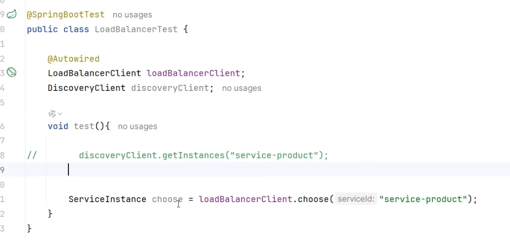

# 1. Nacos 注册中心

# 引入服务注册依赖
## 引入 springCloud 依赖
引入依赖的时候的注意版本适配。


本次创建使用下面的版本 JDK 17 ：


项目工程结构图：


## 引入nacos，进行服务注册
引入 nacos，并配置 nacos 地址。

在 项目工程代码中的 配置文件中，写上 自己的 服务地址，例如：

```properties
spring.application.name=service-product
server.port=8000
# naocos 地址
spring.cloud.nacos.server-add=127.0.0.1:8848
```

启动nacos，在服务列表，可以看到配置的该功能的服务。如下：


# 服务发现
@EnableDiscoveryClient 注解，开启服务发现功能，写在 MainApplication 上面。

里面有两个组件，DiscoveryClient 和 NacosServiceDiscovery，注入就能直接用，能获取到其他在注册中心服务的地址。

# 创建服务内的 api
假设商品服务和订单服务之间的互相调用，基本流程如下：


由于都要建立实体类，最好是建立一个公用的 model 包，里面存放上实体类，然后对应的模块引入 model 依赖。


# 微服务互相调用
在订单模块写一个远程调用商品模块的机器ip和端口号的代码，示例：

```java
private Product getProductFromRemote(Long productId){
// 去注册中心找对应的 ip 和端口号
    List<ServiceInstance> instances = discoverClient.getInstances("service-product");
    ServiceInstance instance = instances.get(0);
    instance.getHost() + ":" + instance.getPort();
}
```

然后根据这个ip和端口号，就可以拼接出一个 url 就知道给什么地址发送请求了。

然后可以写一个配置类，@Bean 一个RestTemplate，然后注入到对应的类里面进行调用。就可以远程调用其他服务的 api 了。

# nacos 负载均衡
## 引入 loadbalancer 依赖
springboot-starter-loadbalancer

## 远程调用
1. **方式一：获取远程地址**



2. **方式二：**

**spring 提供了一个注解 @LoadBalance**， 只要加在远程客户端上，RestTemplate 就自带负载均衡：

```java
@LoadBalance
@Bean
RestTemplate restTemplate(){
    return new RestTemplate();
}
```

这样写就不需要获取远程的ip和端口号了，直接写，url = "http://service-product/product" 就可以了。


> 更新: 2025-02-15 16:35:39  
> 原文: <https://www.yuque.com/xiaoshan_wgo/codingnotes/fdmlm3dh7twe9y67>