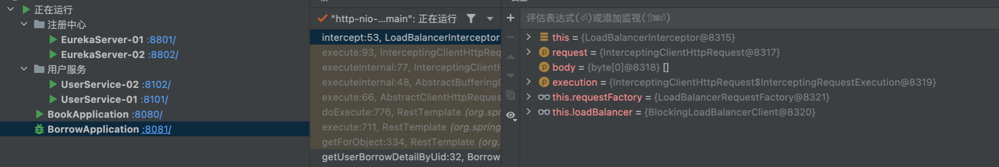
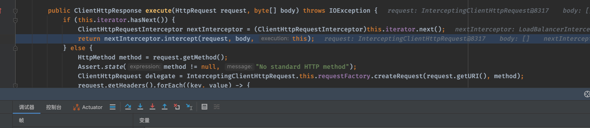
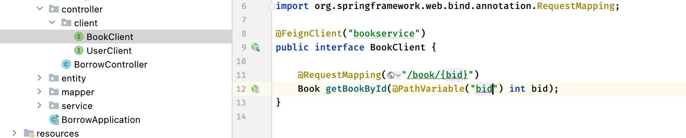
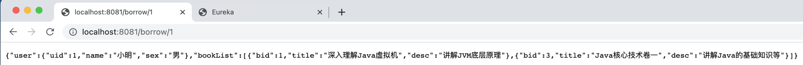

# 【2】LoadBalancer 详细说明

负载均衡到底是如何实现的？

# 负载均衡
实际上，在添加`@LoadBalanced`注解之后，会启用拦截器对发起的服务调用请求进行拦截（注意这里是针对发起的请求进行拦截），叫做`LoadBalancerInterceptor`，它实现`ClientHttpRequestInterceptor`接口：

```java
@FunctionalInterface
public interface ClientHttpRequestInterceptor {
    ClientHttpResponse intercept(HttpRequest request, byte[] body, ClientHttpRequestExecution execution) throws IOException;
}
```

主要是对`intercept`方法的实现：

```java
public ClientHttpResponse intercept(final HttpRequest request, final byte[] body, final ClientHttpRequestExecution execution) throws IOException {
    URI originalUri = request.getURI();
    String serviceName = originalUri.getHost();
    Assert.state(serviceName != null, "Request URI does not contain a valid hostname: " + originalUri);
    return (ClientHttpResponse)this.loadBalancer.execute(serviceName, this.requestFactory.createRequest(request, body, execution));
}
```

打个断点看看实际是怎么在执行的，我看到：





服务端会在发起请求时执行这些拦截器。

那么这个拦截器做了什么事情呢，首先明确了，给过来的请求地址，并不是一个有效的主机名称，而是服务名称，那么怎么才能得到真正需要访问的主机名称呢，肯定是得找 Eureka/Nacos 获取的。

`loadBalancer.execute()`做了什么，它的具体实现为`BlockingLoadBalancerClient`：

```java
//从上面给进来了服务的名称和具体的请求实体
public <T> T execute(String serviceId, LoadBalancerRequest<T> request) throws IOException {
    String hint = this.getHint(serviceId);
    LoadBalancerRequestAdapter<T, DefaultRequestContext> lbRequest = new LoadBalancerRequestAdapter(request, new DefaultRequestContext(request, hint));
    Set<LoadBalancerLifecycle> supportedLifecycleProcessors = this.getSupportedLifecycleProcessors(serviceId);
    supportedLifecycleProcessors.forEach((lifecycle) -> {
        lifecycle.onStart(lbRequest);
    });
  	//可以看到在这里会调用choose方法自动获取对应的服务实例信息
    ServiceInstance serviceInstance = this.choose(serviceId, lbRequest);
    if (serviceInstance == null) {
        supportedLifecycleProcessors.forEach((lifecycle) -> {
            lifecycle.onComplete(new CompletionContext(Status.DISCARD, lbRequest, new EmptyResponse()));
        });
      	//没有发现任何此服务的实例就抛异常（之前的测试中可能已经遇到了）
        throw new IllegalStateException("No instances available for " + serviceId);
    } else {
      	//成功获取到对应服务的实例，这时就可以发起HTTP请求获取信息了
        return this.execute(serviceId, serviceInstance, lbRequest);
    }
}
```

所以，实际上在进行负载均衡的时候，会向Eureka发起请求，选择一个可用的对应服务，然后会返回此服务的主机地址等信息：


# 自定义负载均衡策略
LoadBalancer默认提供了两种负载均衡策略：

+ RandomLoadBalancer - 随机分配策略
+ **(默认)** RoundRobinLoadBalancer - 轮询分配策略

现在希望修改默认的负载均衡策略，可以进行指定，比如现在希望用户服务采用随机分配策略，需要先创建随机分配策略的配置类（不用加`@Configuration`）：

```java
public class LoadBalancerConfig {
  	//将官方提供的 RandomLoadBalancer 注册为Bean
    @Bean
    public ReactorLoadBalancer<ServiceInstance> randomLoadBalancer(Environment environment, LoadBalancerClientFactory loadBalancerClientFactory){
        String name = environment.getProperty(LoadBalancerClientFactory.PROPERTY_NAME);
        return new RandomLoadBalancer(loadBalancerClientFactory.getLazyProvider(name, ServiceInstanceListSupplier.class), name);
    }
}
```

接着需要为对应的服务指定负载均衡策略，直接使用注解即可：

```java
@Configuration
@LoadBalancerClient(value = "userservice",      //指定为 userservice 服务，只要是调用此服务都会使用指定的策略
                    configuration = LoadBalancerConfig.class)   //指定刚刚定义好的配置类
public class BeanConfig {
    @Bean
    @LoadBalanced
    RestTemplate template(){
        return new RestTemplate();
    }
}
```

接着在`BlockingLoadBalancerClient`中添加断点，观察是否采用指定的策略进行请求：


发现访问 userservice 服务的策略已经更改为指定的策略了。

# OpenFeign实现负载均衡
官方文档：[https://docs.spring.io/spring-cloud-openfeign/docs/current/reference/html/](https://docs.spring.io/spring-cloud-openfeign/docs/current/reference/html/)

Feign 和 RestTemplate 一样，也是 HTTP 客户端请求工具，但是它的使用方式更加便捷。首先是依赖：

```xml
<dependency>
    <groupId>org.springframework.cloud</groupId>
    <artifactId>spring-cloud-starter-openfeign</artifactId>
</dependency>
```

接着在启动类添加`@EnableFeignClients`注解：

```java
@SpringBootApplication
@EnableFeignClients
public class BorrowApplication {
    public static void main(String[] args) {
        SpringApplication.run(BorrowApplication.class, args);
    }
}
```

那么现在需要调用其他微服务提供的接口，该怎么做呢？直接创建一个对应服务的接口类即可：

```java
@FeignClient("userservice")   //声明为userservice服务的HTTP请求客户端
public interface UserClient {
}
```

接着直接创建所需类型的方法，比如之前的：

```java
RestTemplate template = new RestTemplate();
User user = template.getForObject("http://userservice/user/"+uid, User.class);
```

现在可以直接写成这样：

```java
@FeignClient("userservice")
public interface UserClient {

  	//路径保证和其他微服务提供的一致即可
    @RequestMapping("/user/{uid}")
    User getUserById(@PathVariable("uid") int uid);  //参数和返回值也保持一致
}
```

接着直接注入使用（有 Mybatis 那味了）：

```java
@Resource
UserClient userClient;

@Override
public UserBorrowDetail getUserBorrowDetailByUid(int uid) {
    List<Borrow> borrow = mapper.getBorrowsByUid(uid);
    
    User user = userClient.getUserById(uid);
    //这里不用再写IP，直接写服务名称bookservice
    List<Book> bookList = borrow
            .stream()
            .map(b -> template.getForObject("http://bookservice/book/"+b.getBid(), Book.class))
            .collect(Collectors.toList());
    return new UserBorrowDetail(user, bookList);
}
```

访问，可以看到结果依然是正确的：


并且可以观察一下两个用户微服务的调用情况，也是以负载均衡的形式进行的。

按照同样的方法，接着将图书管理服务的调用也改成接口形式：



最后的 Service 代码就变成了：

```java
@Service
public class BorrowServiceImpl implements BorrowService {

    @Resource
    BorrowMapper mapper;

    @Resource
    UserClient userClient;
    
    @Resource
    BookClient bookClient;

    @Override
    public UserBorrowDetail getUserBorrowDetailByUid(int uid) {
        List<Borrow> borrow = mapper.getBorrowsByUid(uid);

        User user = userClient.getUserById(uid);
        List<Book> bookList = borrow
                .stream()
                .map(b -> bookClient.getBookById(b.getBid()))
                .collect(Collectors.toList());
        return new UserBorrowDetail(user, bookList);
    }
}
```

继续访问进行测试：




> 更新: 2025-05-13 22:50:37  
> 原文: <https://www.yuque.com/xiaoshan_wgo/codingnotes/xs1bpiavfgeqsd1p>