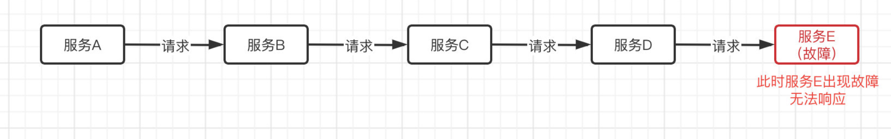
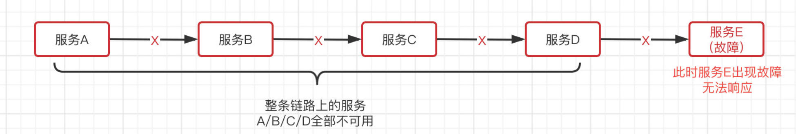

# 【3】Hystrix 服务熔断

官方文档：[https://cloud.spring.io/spring-cloud-static/spring-cloud-netflix/1.3.5.RELEASE/single/spring-cloud-netflix.html#_circuit_breaker_hystrix_clients](https://cloud.spring.io/spring-cloud-static/spring-cloud-netflix/1.3.5.RELEASE/single/spring-cloud-netflix.html#_circuit_breaker_hystrix_clients)

我们知道，微服务之间是可以进行相互调用的，那么如果出现了下面的情况会导致什么问题？

由于位于最底端的服务提供者E发生故障，那么此时会直接导致服务ABCD全线崩溃，就像雪崩了一样。

这种问题实际上是不可避免的，由于多种因素，比如网络卡顿、系统故障、硬件问题等，都存在一定可能，会导致这种极端的情况发生。因此，我们需要寻找一个应对这种极端情况的解决方案。

为了解决分布式系统的雪崩问题，SpringCloud 提供了 Hystrix 熔断器组件，他就像我们家中的保险丝一样，当电流过载就会直接熔断，防止危险进一步发生，从而保证家庭用电安全。可以想象一下，如果整条链路上的服务已经全线崩溃，这时还在不断地有大量的请求到达，需要各个服务进行处理，肯定是会使得情况越来越糟糕的。

> 更新: 2025-05-13 22:51:45  
> 原文: <https://www.yuque.com/xiaoshan_wgo/codingnotes/qau6mcedqydbsgtv>